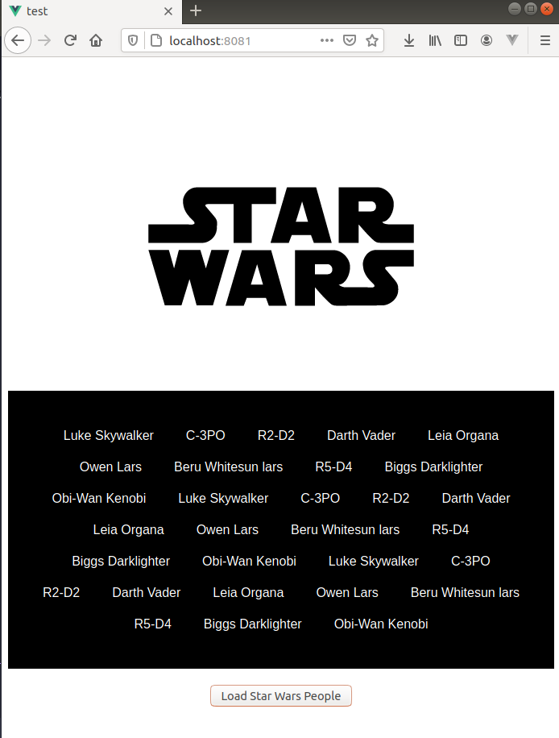

# Vue 3 - test 
### Dynamic props - one way data bind between child/child components

## Demo



## Project setup
```
yarn install
```

### Compiles and hot-reloads for development
```
yarn serve
```
